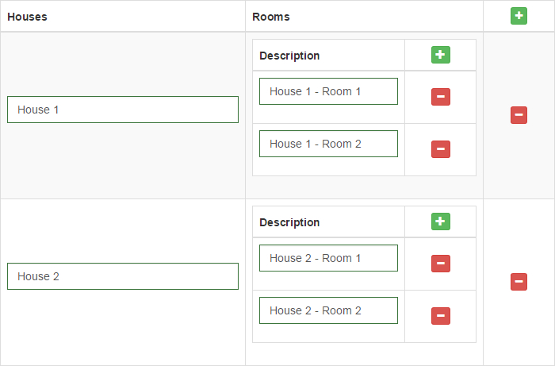
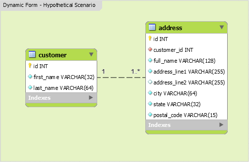

# Yii2 Extension for Making Dynamic Forms

[](https://github.com/yii2-extensions/dynamicform/releases)
[](LICENSE.md)
[](https://packagist.org/packages/yii2-extensions/dynamicform)


It is widget to yii2 framework to clone form elements in a nested manner, maintaining accessibility.


## Installation


The preferred way to install this extension is through [composer](http://getcomposer.org/download/).

Either run

```
composer require --prefer-dist yii2-extensions/dynamicform:"^1.0.0"
```

or add

```
"yii2-extensions/dynamicform": "^1.0.0"
```

to the require section of your `composer.json` file. 

## Extension Usage

### Databases
To explain usage of this extension we are going to have a sample scenario where we are building address book  for customers.
Each customer can have multiple addresses. See the image below for further details. 




### Models
With that database, our assumption is you have two models `Customer` and `Address` classes.

```php
<?php

namespace app\models;

class Customer extends ActiveRecord
{
    public static function tableName()
    {
        return 'customer';
    }

    //....
    //normal Yii AR stuffs
}
```


```php
<?php

namespace app\models;

class Address extends ActiveRecord
{
    public static function tableName()
    {
        return 'address';
    }

    //....
    //normal Yii AR stuffs
}
```


### The Controller
#### 1. Create Action
```php
<?php

namespace app\controllers;

use Yii2\Extensions\DynamicForm\Models\Model; //Very important. Do not mix this with yii\base\Model

class CustomerController extends Controller
{
    
    public function actionCreate()
    {
        $modelCustomer = new Customer;
        $modelsAddress = [new Address];
        if ($modelCustomer->load(Yii::$app->request->post())) {

            $modelsAddress = Model::createMultiple(Address::classname());
            Model::loadMultiple($modelsAddress, Yii::$app->request->post());

            // ajax validation
            if (Yii::$app->request->isAjax) {
                Yii::$app->response->format = Response::FORMAT_JSON;
                return ArrayHelper::merge(
                    ActiveForm::validateMultiple($modelsAddress),
                    ActiveForm::validate($modelCustomer)
                );
            }

            // validate all models
            $valid = $modelCustomer->validate();
            $valid = Model::validateMultiple($modelsAddress) && $valid;
            
            if ($valid) {
                $transaction = \Yii::$app->db->beginTransaction();
                try {
                    if ($flag = $modelCustomer->save(false)) {
                        foreach ($modelsAddress as $modelAddress) {
                            $modelAddress->customer_id = $modelCustomer->id;
                            if (! ($flag = $modelAddress->save(false))) {
                                $transaction->rollBack();
                                break;
                            }
                        }
                    }
                    if ($flag) {
                        $transaction->commit();
                        return $this->redirect(['view', 'id' => $modelCustomer->id]);
                    }
                } catch (Exception $e) {
                    $transaction->rollBack();
                }
            }
        }

        return $this->render('create', [
            'modelCustomer' => $modelCustomer,
            'modelsAddress' => (empty($modelsAddress)) ? [new Address] : $modelsAddress
        ]);
    } 
}
```
 
#### 2. Update Action
```php
<?php

namespace app\controllers;

use Yii2\Extensions\DynamicForm\Models\Model; //Very important. Do not mix this with yii\base\Model

class CustomerController extends Controller
{
    public function actionUpdate($id)
    {
        $modelCustomer = $this->findModel($id);
        $modelsAddress = $modelCustomer->addresses;

        if ($modelCustomer->load(Yii::$app->request->post())) {

            $oldIDs = ArrayHelper::map($modelsAddress, 'id', 'id');
            $modelsAddress = Model::createMultiple(Address::classname(), $modelsAddress);
            Model::loadMultiple($modelsAddress, Yii::$app->request->post());
            $deletedIDs = array_diff($oldIDs, array_filter(ArrayHelper::map($modelsAddress, 'id', 'id')));

            // ajax validation
            if (Yii::$app->request->isAjax) {
                Yii::$app->response->format = Response::FORMAT_JSON;
                return ArrayHelper::merge(
                    ActiveForm::validateMultiple($modelsAddress),
                    ActiveForm::validate($modelCustomer)
                );
            }

            // validate all models
            $valid = $modelCustomer->validate();
            $valid = Model::validateMultiple($modelsAddress) && $valid;

            if ($valid) {
                $transaction = \Yii::$app->db->beginTransaction();
                try {
                    if ($flag = $modelCustomer->save(false)) {
                        if (! empty($deletedIDs)) {
                            Address::deleteAll(['id' => $deletedIDs]);
                        }
                        foreach ($modelsAddress as $modelAddress) {
                            $modelAddress->customer_id = $modelCustomer->id;
                            if (! ($flag = $modelAddress->save(false))) {
                                $transaction->rollBack();
                                break;
                            }
                        }
                    }
                    if ($flag) {
                        $transaction->commit();
                        return $this->redirect(['view', 'id' => $modelCustomer->id]);
                    }
                } catch (Exception $e) {
                    $transaction->rollBack();
                }
            }
        }

        return $this->render('update', [
            'modelCustomer' => $modelCustomer,
            'modelsAddress' => (empty($modelsAddress)) ? [new Address] : $modelsAddress
        ]);
    }
}
```
 

### The View
The View presents our complex form that will dynamically add or remove items. At the hear of it is the `DynamicFormWidget`
The following are some details on widget profperties:
- `widgetContainer`: Top container for the widget. Can only be alphanumeric plus a `_` character. It is required
- `widgetBody` : The Container that hosts rows of form elements. Its value must conform to css class. It is required
- `widgetItem` : Represents single row of form line. If you are used to Bootstrap grid, `widgetBody` is similar to a container and `widgetItem` to a row. It is a required element and must be in the format of css class
- `limit` : Maximum number of clones. It is an integer. Limits the number of times element can be cloned. Defaults to 999.
- `min` : Minimum number of elements by default. Set it to 0 if you want empty sub-form elements or 1 to start with single row. Defaults to 1.
- `insertButton` : Css class name for an element when clicked will add a row in the form.
- `deleteButton` : Css class name for an element when clicked will delete a row in the form.
- `model` : Sample model for the widget. If you are not sure, pass first element of the model rows. This requires your controller always send at least single model to the view.
- `formId` : ID of your `ActiveForm`. Mismatching the two is a recipe for disaster. Be careful!

Sample view

```php
<?php
use yii\helpers\Html;
use yii\widgets\ActiveForm;
use Yii2\Extensions\DynamicForm\DynamicFormWidget;
?>

<div class="customer-form">
    <?php $form = ActiveForm::begin(['id' => 'dynamic-form']); ?>
    <div class="row">
        <div class="col-sm-6">
            <?= $form->field($modelCustomer, 'first_name')->textInput(['maxlength' => true]) ?>
        </div>
        <div class="col-sm-6">
            <?= $form->field($modelCustomer, 'last_name')->textInput(['maxlength' => true]) ?>
        </div>
    </div>

    <div class="panel panel-default">
        <div class="panel-heading"><h4><i class="glyphicon glyphicon-envelope"></i> Addresses</h4></div>
        <div class="panel-body">
             <?php DynamicFormWidget::begin([
                'widgetContainer' => 'dynamicform_wrapper', // required: only alphanumeric characters plus "_" [A-Za-z0-9_]
                'widgetBody' => '.container-items', // required: css class selector
                'widgetItem' => '.item', // required: css class.
                'limit' => 4, // the maximum times, an element can be cloned (default 999)
                'min' => 1, // 0 or 1 (default 1)
                'insertButton' => '.add-item', // css class
                'deleteButton' => '.remove-item', // css class
                'model' => $modelsAddress[0],
                'formId' => 'dynamic-form',
                'formFields' => [
                    'full_name',
                    'address_line1',
                    'address_line2',
                    'city',
                    'state',
                    'postal_code',
                ],
            ]); ?>

            <div class="container-items"><!-- widgetContainer -->
            <?php foreach ($modelsAddress as $i => $modelAddress): ?>
                <div class="item panel panel-default"><!-- widgetBody -->
                    <div class="panel-heading">
                        <h3 class="panel-title pull-left">Address</h3>
                        <div class="pull-right">
                            <button type="button" class="add-item btn btn-success btn-xs"><i class="glyphicon glyphicon-plus"></i></button>
                            <button type="button" class="remove-item btn btn-danger btn-xs"><i class="glyphicon glyphicon-minus"></i></button>
                        </div>
                        <div class="clearfix"></div>
                    </div>
                    <div class="panel-body">
                        <?php
                            // necessary for update action.
                            if (! $modelAddress->isNewRecord) {
                                echo Html::activeHiddenInput($modelAddress, "[{$i}]id");
                            }
                        ?>
                        <?= $form->field($modelAddress, "[{$i}]full_name")->textInput(['maxlength' => true]) ?>
                        <div class="row">
                            <div class="col-sm-6">
                                <?= $form->field($modelAddress, "[{$i}]address_line1")->textInput(['maxlength' => true]) ?>
                            </div>
                            <div class="col-sm-6">
                                <?= $form->field($modelAddress, "[{$i}]address_line2")->textInput(['maxlength' => true]) ?>
                            </div>
                        </div><!-- .row -->
                        <div class="row">
                            <div class="col-sm-4">
                                <?= $form->field($modelAddress, "[{$i}]city")->textInput(['maxlength' => true]) ?>
                            </div>
                            <div class="col-sm-4">
                                <?= $form->field($modelAddress, "[{$i}]state")->textInput(['maxlength' => true]) ?>
                            </div>
                            <div class="col-sm-4">
                                <?= $form->field($modelAddress, "[{$i}]postal_code")->textInput(['maxlength' => true]) ?>
                            </div>
                        </div><!-- .row -->
                    </div>
                </div>
            <?php endforeach; ?>
            </div>
            <?php DynamicFormWidget::end(); ?>
        </div>
    </div>

    <div class="form-group">
        <?= Html::submitButton($modelCustomer->isNewRecord ? 'Create' : 'Update', ['class' => 'btn btn-primary']) ?>
    </div>

    <?php ActiveForm::end(); ?>

</div>
```

### Javascript Events

```javascript

$(".dynamicform_wrapper").on("beforeInsert", function(e, item) {
    console.log("beforeInsert");
});

$(".dynamicform_wrapper").on("afterInsert", function(e, item) {
    console.log("afterInsert");
});

$(".dynamicform_wrapper").on("beforeDelete", function(e, item) {
    if (! confirm("Are you sure you want to delete this item?")) {
        return false;
    }
    return true;
});

$(".dynamicform_wrapper").on("afterDelete", function(e) {
    console.log("Deleted item!");
});

$(".dynamicform_wrapper").on("limitReached", function(e, item) {
    alert("Limit reached");
});

```

### Special Thanks
Special thanks to Wanderson Bragança for creating wonderful extension. We are here to make sure that his good work does not die. We are making our best to preserve his identity throughout the code he wrote. 

Thank you Wanderson!

Check original work at https://github.com/wbraganca/yii2-dynamicform

### Questions and Contributions
Contributions are welcome in form of PR. Please make a pull request to our github repository.
You can ask a question or suggest a feature or file a bug using github issues.

Please star our repositories if you find them useful.

If you are on X, don't forget to connect with us at:
[@yiiframework](https://twitter.com/yiiframework) for Yii Framework
[@yiiupdates](https://twitter.com/yiiupdates) for Yii News and Updates
